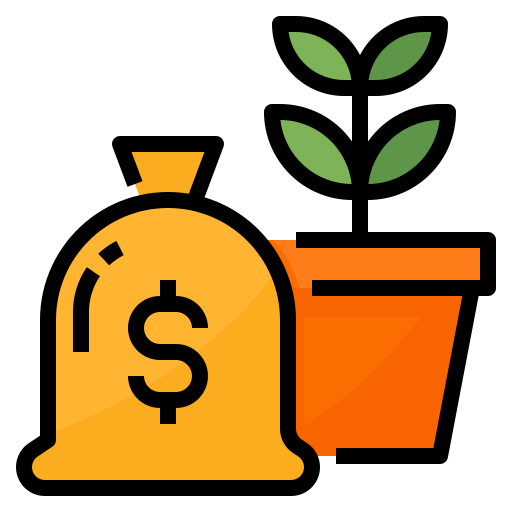

[](https://shields.io/)

<div align="center">
	<br>
	<br>
	
	<h1>DCA-Crypto</h1>
	<p>
    <b>Simple DCA script for cryptocurrency using the ccxt API.</b>
	</p>
	<br>
	<br>
	<br>
</div>

This script will invest, every day, a certain amount of money 
on the different currencies listed in a .json file. These 
investments can be currency weighted, and depend on the 
performance of the assets during the day (those that perform 
better will have a smaller investment, and vice versa).
The script is very flexible according to your needs and will 
output daily records of your investment as a .csv file.

## Usage

### Your currencies

You have to modify the `currencies.json` file depending on
the objectives of your investment.
Each asset should be in the following format:

```json
"Asset name": {
    "symbol": "ASSETSYMBOL",
    "weight": X
},
```

Where:
- `"ASSETSYMBOL"` is the symbol that identifies the currency
  (e.g. BTC for Bitcoin).
- `X` is a number in [0, 1], s.t. the sum of the weights
  in the file is equal to 1. It defines the proportion of
  the investment that you want to put in this currency.


### The script

The script is scheduled to run once a day, at a given
hour. In order to perform its task, it must not be stopped
once launched.

```bash
python dca.py $EXCHANGE $YOUR_API_KEY $YOUR_API_SECRET $DAILY_INVESTMENT $FIAT $FEES $HH
```

- `$EXCHANGE` defines the exchange used to perform the purchases 
  (the list of the available exchanges is available on 
  [ccxt](https://github.com/ccxt/ccxt)).
- `$YOUR_API_KEY` and `$YOUR_API_SECRET` can be obtained on
  the exchange and allow its API level access. 
- `$DAILY_INVESTMENT` defines your daily investment quantity
  (the unit being `$FIAT`).   
- `$FIAT` defines the currency used to make the purchases. 
- `$FEES` corresponds to the amount deducted by the exchange
  on every transaction that you made (0 if unknown). 
- `$HH` defines the hour at which the script will perform the
  investment.

Example for crypto.com/exchange, with 4% fees, using 20 USDT/day, 
and buying every day at 12:00:

```bash
python dca.py cryptocom XXXX ZZZZ 20 USDT 0.04 12
```

## Attributions

- <div>
	Icon made by 
	<a href="https://www.flaticon.com/authors/flat-icons" title="Flat Icons">Monkik - Flat Icons</a> 
	from 
	<a href="https://www.flaticon.com/" title="Flaticon">www.flaticon.com</a>
  </div>

- [ccxt API](https://github.com/ccxt/ccxt)
